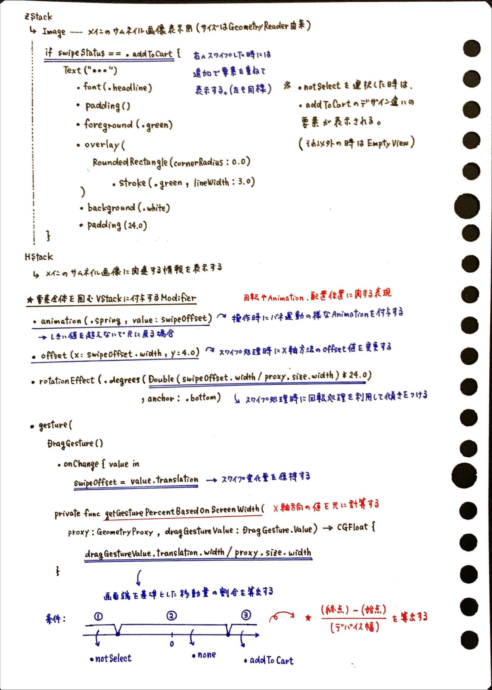
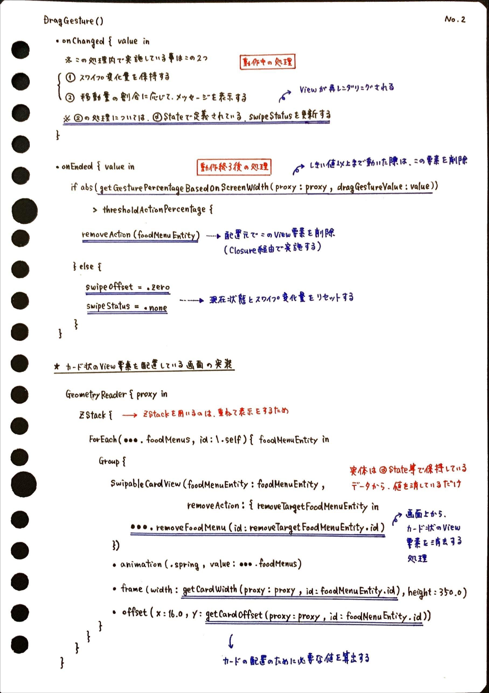

# TinderCartExampleSwiftUI
[ING] - SwiftUIで作成するTinder風のCard切り替え操作をするサンプル

以前にUIKitでも作成した経験がある、Tinderの様にスワイプ操作を利用してマッチング相手を選出する形のUIに類似した構造をSwiftUIのDragGestureを利用して組み立てたサンプルになります。

__【参考資料】__

- [SwiftUI-Tinder-SwipeableCards](https://github.com/bbaars/SwiftUI-Tinder-SwipeableCards)
- [SwiftUI: Create a Tinder-Style Swipeable Card View](https://betterprogramming.pub/swiftui-create-a-tinder-style-swipeable-card-view-283e257cb102)

__【過去にUIKitを利用して作成したサンプル】__

- [TinderUISamples](https://github.com/fumiyasac/TinderUISamples)

## 1. サンプル概要

 

__【🎥 Movie】__

https://github.com/user-attachments/assets/aa38805b-2aa3-4529-9831-189eaae4b13b

## 2. 設計資料

実装方針や着眼点を解説した図解ノートになります。

__【📝 Note of Tinder Type UI Imprementation】__

